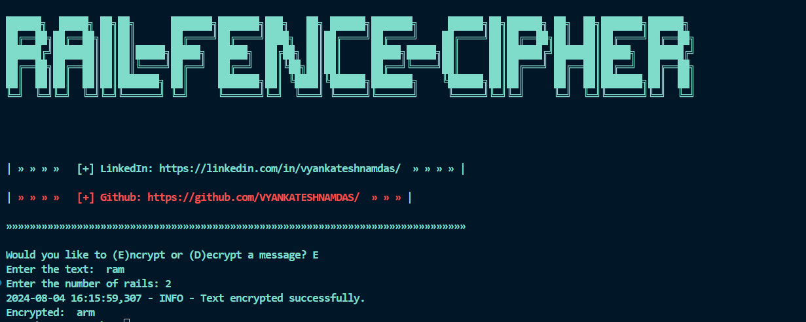
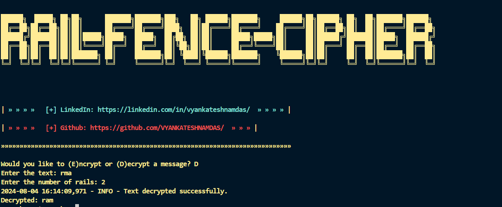

# Rail Fence Cipher

This repository contains a Python script for encrypting and decrypting messages using the Rail Fence Cipher.

## Features

- Encrypt a message using the Rail Fence Cipher
- Decrypt an encrypted message using the Rail Fence Cipher
- User-friendly command-line interface
- Error handling and logging for better usability

## images
 

## Prerequisites

- Python 3.x

## Getting Started

### Clone the Repository

## Run the Script
To use the script, simply run the rail_cipher.py file:

- python rail_cipher.py

## Usage
When you run the script, you will be prompted to choose whether you want to encrypt or decrypt a message. After selecting an option, you will enter the text and the number of rails.

Would you like to (E)ncrypt or (D)ecrypt a message? E

Enter the text: HELLO

Enter the number of rails: 3

Encrypted: HLOEL

Would you like to (E)ncrypt or (D)ecrypt a message? D

Enter the text: HLOEL

Enter the number of rails: 3

Decrypted: HELLO

## Example

Encrypting a message:

Would you like to (E)ncrypt or (D)ecrypt a message? E

Enter the text: ATTACKATDAWN

Enter the number of rails: 3

Encrypted: ATDAWNTTACA

Decrypting a message:

Would you like to (E)ncrypt or (D)ecrypt a message? D

Enter the text: ATDAWNTTACA

Enter the number of rails: 3

Decrypted: ATTACKATDAWN

## Code Explanation
### The script uses a Rail Fence Cipher algorithm to encrypt and decrypt messages. It first asks the user to choose between encryption and decryption, then prompts for the necessary inputs. The script includes error handling to manage invalid inputs and uses logging for tracking the process.

## Logging
- The script uses the logging module to log important events, such as successful encryption/decryption and error messages.

## Contributing
Contributions are welcome! Please open an issue or submit a pull request if you have any suggestions or improvements.

