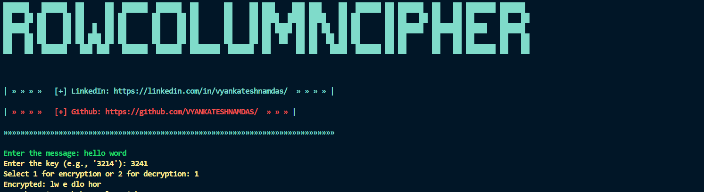
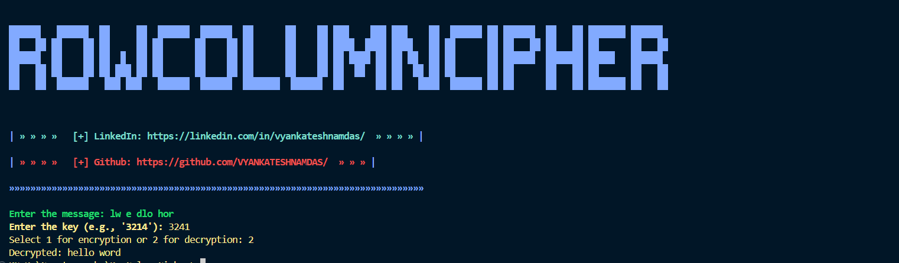

# Row-Column Transposition Cipher

This project implements a row-column transposition cipher in Python. The cipher allows for both encryption and decryption of messages using a specified key.

## Features

- Encrypt a message using a row-column transposition cipher.
- Decrypt a message encrypted with the row-column transposition cipher.
- Log all encryption and decryption activities.
- Handle errors gracefully with appropriate messages.
  
## images
 



## Requirements

- Python 3.x
- Required libraries: `os`, `logging`
- Custom setup files: `setup/sprint.py`, `setup/colors.py`, `setup/banner.py`

## Setup

1. **Clone the repository:**
   ```bash
   git clone https://github.com/vyankateshnamdas/RowColumnCipher.git
   
2 **Navigate to the project directory:**
  ```bash
  cd your-repo-name
  ```

## Usage

Run the script using Python:

- python RowColumnCipher.py

**Encryption**
 ```bash
Enter the message you want to encrypt.
Enter the key (e.g., '3214'). The key must be a string of digits.
Select 1 for encryption.
```

 ```bash
Decryption
Enter the message you want to decrypt.
Enter the key (e.g., '3214'). The key must be a string of digits.
Select 2 for decryption.
```
## Example

**Encryption**
```bash
Enter the message: HELLO WORLD
Enter the key (e.g., '3214'): 3214
Select 1 for encryption or 2 for decryption: 1
Encrypted: ELHLO OWLDR
```

```bash
Decryption
Enter the message: ELHLO OWLDR
Enter the key (e.g., '3214'): 3214
Select 1 for encryption or 2 for decryption: 2
Decrypted: HELLO WORLD
```

## Logging
- All encryption and decryption activities are logged to RowColumnCipher.log in the project directory. The log includes timestamps, log levels, and messages.

## Error Handling
- The script includes exception handling to manage and log errors:
- Invalid key (non-digit string).
- Invalid choice (not 1 or 2).
- Unexpected errors during encryption and decryption.
  
## License
- This project is licensed under the MIT License. See the LICENSE file for details.

## Contributing
- Fork the repository.
- Create a new branch: git checkout -b my-new-feature.
- Make your changes and commit them: git commit -am 'Add some feature'.
- Push to the branch: git push origin my-new-feature.
- Submit a pull request.
  
## Acknowledgments
Thank you to the contributors of the setup files used in this project.
Contact
